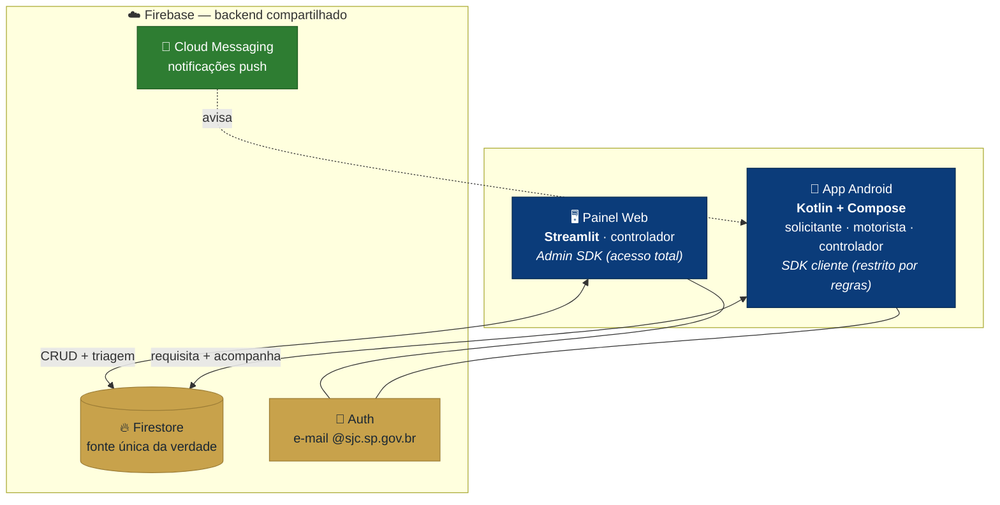
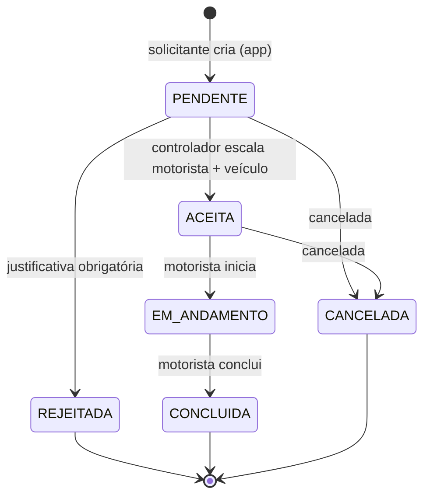

<div align="center">

# 🚐 Transporte SJC

### Gestão de escala de motoristas e veículos da Prefeitura

Painel web de controle **+** app móvel, sobre um backend único no Firebase.

<br/>


</div>

---

## 📖 Sobre

O **Transporte SJC** centraliza o pedido, a aprovação e a escala de viagens da frota
municipal. Um servidor pede uma viagem pelo **app**; a requisição entra **em tempo real** no
**calendário do painel web**; o **controlador** aceita (atribuindo motorista e veículo) ou
rejeita com justificativa; a decisão volta na hora para quem pediu e para o motorista escalado.

> 🧭 O acompanhamento e a ampliação do projeto são feitos pelo **[`docs/PLANO.md`](./docs/PLANO.md)**
> (superplano por fases). Arquitetura e modelo de dados detalhados no **[`CLAUDE.md`](./CLAUDE.md)**.

## 🏗️ Arquitetura



A UI de cada cliente fala **apenas com uma interface de repositório** — hoje implementada com
dados mockados, e com a troca para o Firebase concentrada em **um único ponto** por cliente.

## 🔁 Ciclo de vida de uma viagem



> 🛡️ **Invariante central:** ao aceitar, o sistema bloqueia **conflito de agenda** — um motorista
> ou veículo não pode estar escalado em duas viagens que se sobreponham no tempo.

## ✨ Funcionalidades

O **painel web** agora tem **login com dois papéis** — auto-cadastro é livre e sempre
vira solicitante; controlador só promove quem já tem conta (autenticação local por
enquanto, sem Firebase — ver [`web/README.md`](./web/README.md)).

| 🖥️ Painel Web — Controlador | 🖥️ Painel Web — Solicitante | 📱 App (solicitante / motorista / controlador) |
|---|---|---|
| Cadastro de **motoristas** (nome, matrícula, cargo, secretaria, telefone, CNH) | Criar **nova requisição** de viagem | **Solicitante:** criar requisição e acompanhar status |
| Cadastro de **veículos** (prefixo, placa, **placa patrimonial**, modelo, ano, capacidade, combustível) | Acompanhar **minhas requisições** e cancelar (antes de em andamento) | **Motorista:** ver escala · iniciar e concluir viagem |
| Cadastro de **secretarias** e gestão de **papéis** | | **Controlador:** visão geral (status do dia) |
| **Calendário/triagem:** aceitar e escalar · rejeitar e justificar | | Login institucional `@sjc.sp.gov.br` |
| Checagem de **conflito de agenda** | | Cores de status consistentes com o painel |

## 🧱 Stack

- **Painel web:** Python + **Streamlit** · `firebase-admin` (Admin SDK)
- **App:** **Kotlin** + Jetpack Compose (Material 3), MVVM
- **Backend:** **Firebase** — Firestore (dados), Auth (e-mail/senha restrito a `@sjc.sp.gov.br`), Cloud Messaging (push)

## 🗂️ Estrutura

```
Transporte/
├── web/        # Painel Streamlit (domínio + Repository Mock/Firebase + páginas + testes)
├── app/        # App Android Kotlin/Compose (mesmo contrato + Mock/Firebase + testes)
├── firebase/   # (próx. fase) regras, índices, config
├── docs/
│   └── PLANO.md   # superplano / acompanhamento por fases
├── CLAUDE.md   # arquitetura e modelo de dados
└── README.md
```

## 🚀 Como rodar

**Painel web** (Linux/Debian — use venv!). Mais em [`web/README.md`](./web/README.md):

```bash
cd web
python3 -m venv .venv && source .venv/bin/activate
pip install -r requirements.txt
streamlit run app.py            # http://localhost:8501
.venv/bin/python -m pytest      # 28 testes (unit + integração + smoke de UI)
```

**App Android** — abra a pasta `app/` no Android Studio e rode no emulador (API 24+).
Login mock com botões de acesso por papel. Mais em [`app/README.md`](./app/README.md):

```bash
cd app
./gradlew test                  # unit tests (JVM)
./gradlew installDebug          # requer gradle-wrapper (ver app/README.md)
```

**Backend local (quando o Firebase entrar):** `firebase emulators:start`

## 🗺️ Roadmap

- [~] **Fase 0 — Fundação:** monorepo, contrato de dados e tema SJC ✅; projeto Firebase + regras + emuladores pendentes
- [x] **Fase 1 — Painel web (MVP):** login (dois papéis, auth local) + cadastros e papéis *(mock)*
- [x] **Fase 2 — Calendário:** triagem com checagem de conflito *(mock, com testes)*
- [~] **Fase 3 — Solicitante:** criar requisição e acompanhar, hoje **no app e no painel** *(mock)*; auto-cadastro `@sjc.sp.gov.br` + verificação de e-mail pendem do Firebase
- [x] **Fase 4 — App (motorista/controlador):** escala, avançar status, visão geral *(mock)*
- [ ] **Fase 5 — Notificações (FCM) + relatórios**
- [ ] **Fase 6 — Hardening + piloto**

> **Estado atual:** painel web e app **funcionais para teste com dados mockados**, prontos para
> ligar o Firebase (ponto de troca único em cada cliente).

## 🎨 Identidade visual (SJC)

<div align="center">


</div>

Azul institucional (primária), dourado (destaque) e verde (positivo), aplicados igualmente nos
dois clientes. *Paleta a confirmar com o manual de marca oficial antes do piloto.*

---

<div align="center">
🏛️ Projeto para a <b>Prefeitura de São José dos Campos</b> · feito com Streamlit, Kotlin e Firebase
</div>
